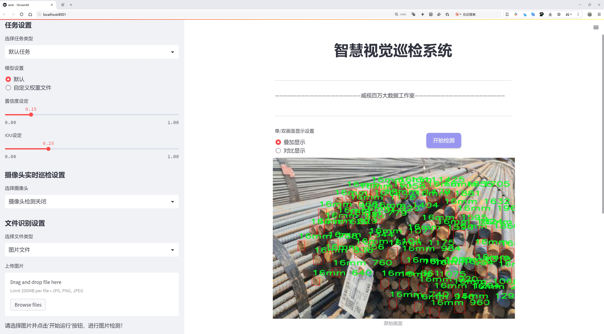
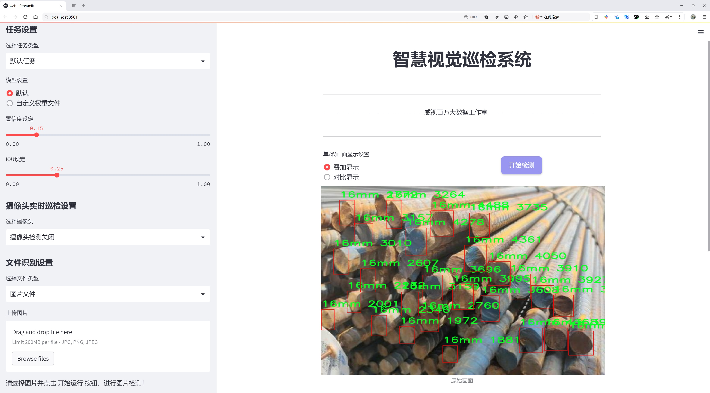
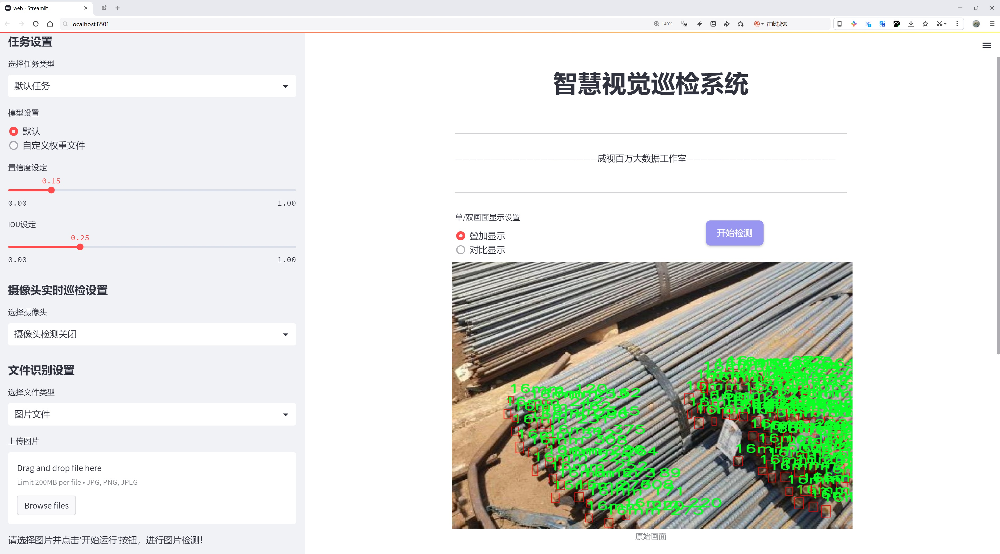
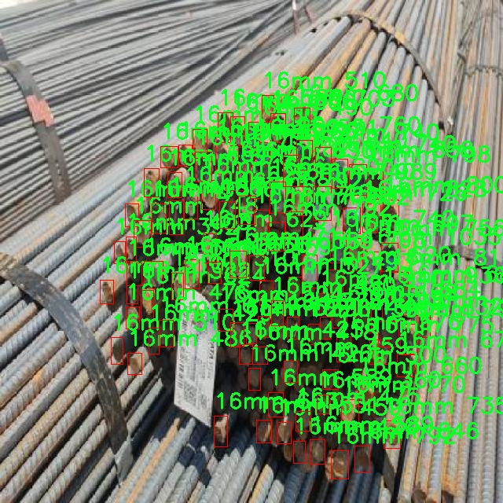
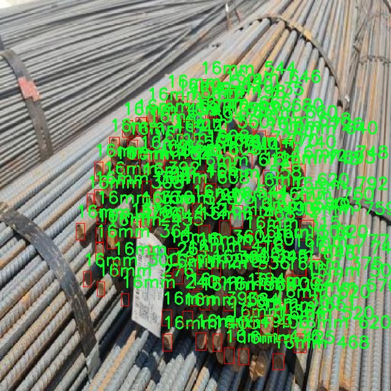
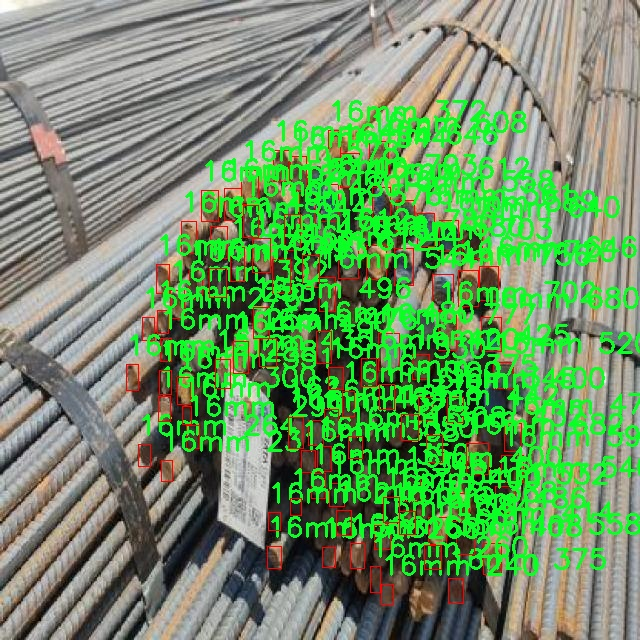
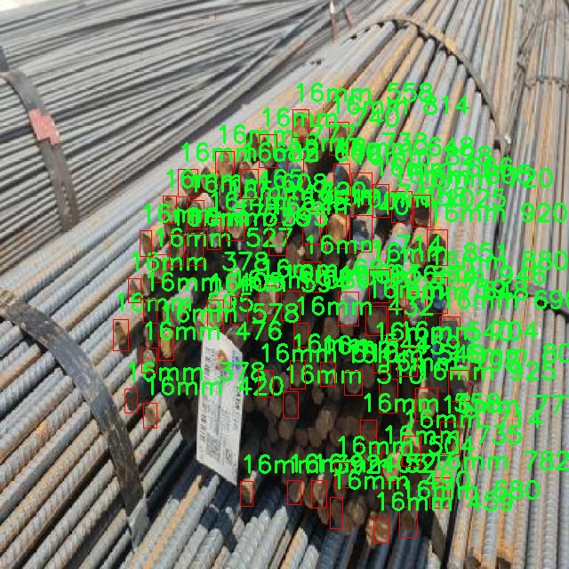

# 钢筋检测检测系统源码分享
 # [一条龙教学YOLOV8标注好的数据集一键训练_70+全套改进创新点发刊_Web前端展示]

### 1.研究背景与意义

项目参考[AAAI Association for the Advancement of Artificial Intelligence](https://gitee.com/qunmasj/projects)

研究背景与意义

随着建筑行业的快速发展，钢筋作为混凝土结构的重要组成部分，其质量和数量的检测变得愈发重要。传统的钢筋检测方法多依赖人工目测或简单的测量工具，这不仅效率低下，而且容易受到人为因素的影响，导致检测结果的不准确性和不一致性。因此，如何提高钢筋检测的自动化和智能化水平，成为了当前建筑工程领域亟待解决的问题。近年来，深度学习技术的迅猛发展为这一问题提供了新的解决思路。尤其是目标检测领域的先进算法，如YOLO（You Only Look Once）系列，因其高效的实时检测能力和较高的准确率，逐渐成为研究者们关注的焦点。

YOLOv8作为YOLO系列的最新版本，具备了更强的特征提取能力和更快的推理速度，适用于各种复杂场景下的目标检测任务。在钢筋检测中，YOLOv8能够通过其深度学习模型快速识别不同直径的钢筋，并提供准确的定位信息，从而为后续的工程质量控制提供数据支持。为此，基于改进YOLOv8的钢筋检测系统的研究具有重要的理论和实践意义。

本研究所使用的数据集包含2495张图像，涵盖了三种不同直径的钢筋类别：16mm、32mm和8mm。这一数据集的构建为模型的训练和验证提供了坚实的基础。通过对不同直径钢筋的识别与分类，研究者能够深入分析钢筋在不同施工阶段的使用情况，进而为施工管理提供科学依据。此外，数据集中包含的多样化图像样本能够有效提高模型的泛化能力，使其在实际应用中表现出更强的适应性。

在研究过程中，我们将针对YOLOv8模型进行改进，以提高其在钢筋检测任务中的性能。这包括优化模型的网络结构、调整超参数、增强数据集的多样性等。通过这些改进，我们期望能够显著提升模型的检测精度和速度，使其在实际工程应用中具备更高的实用价值。

总之，基于改进YOLOv8的钢筋检测系统的研究，不仅能够推动建筑行业智能化检测技术的发展，还能为相关领域的研究提供新的思路和方法。随着智能建筑的不断普及，钢筋检测的自动化程度将直接影响到工程的安全性和经济性。因此，本研究的开展具有重要的现实意义和广阔的应用前景，必将为建筑行业的技术进步和质量提升贡献力量。

### 2.图片演示







##### 注意：由于此博客编辑较早，上面“2.图片演示”和“3.视频演示”展示的系统图片或者视频可能为老版本，新版本在老版本的基础上升级如下：（实际效果以升级的新版本为准）

  （1）适配了YOLOV8的“目标检测”模型和“实例分割”模型，通过加载相应的权重（.pt）文件即可自适应加载模型。

  （2）支持“图片识别”、“视频识别”、“摄像头实时识别”三种识别模式。

  （3）支持“图片识别”、“视频识别”、“摄像头实时识别”三种识别结果保存导出，解决手动导出（容易卡顿出现爆内存）存在的问题，识别完自动保存结果并导出到。

  （4）支持Web前端系统中的标题、背景图等自定义修改，后面提供修改教程。

  另外本项目提供训练的数据集和训练教程,暂不提供权重文件（best.pt）,需要您按照教程进行训练后实现图片演示和Web前端界面演示的效果。

### 3.视频演示

[3.1 视频演示](https://www.bilibili.com/video/BV13nsHeKEU9/?vd_source=ff015de2d29cbe2a9cdbfa7064407a08)

### 4.数据集信息展示

数据集信息展示

在现代建筑工程中，钢筋的检测与识别是确保结构安全与稳定的重要环节。为此，我们构建了一个专门用于训练改进YOLOv8的钢筋检测系统的数据集，命名为“yash1”。该数据集旨在提升钢筋检测的准确性和效率，特别是在复杂的施工环境中。数据集包含2495张高质量的图像，这些图像经过精心挑选和标注，确保了数据的多样性和代表性。

“yash1”数据集共涵盖三种不同直径的钢筋类别，分别为16mm、32mm和8mm。这三种类别的选择不仅考虑到了实际施工中常用的钢筋规格，也为模型的训练提供了丰富的样本，使其能够在不同情况下进行有效的识别与分类。每个类别的图像数量均衡，确保了模型在训练过程中不会偏向某一特定类别，从而提高了模型的泛化能力。

数据集中的图像来源于真实的施工现场，涵盖了各种光照条件、角度和背景。这种多样性使得模型在面对实际应用时，能够更好地适应不同的环境和条件。例如，某些图像是在明亮的阳光下拍摄的，而另一些则是在阴影或低光照条件下获取的。这种变化不仅考验了模型的鲁棒性，也为其在实际应用中的表现提供了更高的可靠性。

在标注过程中，我们采用了精确的边界框技术，确保每一根钢筋都被准确地框定。这样的细致标注使得YOLOv8模型在训练时能够获得准确的位置信息，从而提高了其检测精度。此外，数据集还包含了不同背景下的钢筋图像，如混凝土、砖石等材料，这为模型提供了丰富的上下文信息，帮助其更好地理解钢筋与周围环境的关系。

该数据集遵循CC BY 4.0许可证，允许用户在遵循相关条款的前提下自由使用和修改数据。这种开放性不仅促进了学术研究的交流与合作，也为工程师和研究人员提供了宝贵的资源，以推动钢筋检测技术的发展。

总之，“yash1”数据集为改进YOLOv8的钢筋检测系统提供了坚实的基础。通过对2495张图像的精心标注和多样化的类别设置，我们相信该数据集将为钢筋检测的自动化和智能化提供强有力的支持。未来，随着深度学习技术的不断进步和数据集的不断完善，我们期待在钢筋检测领域取得更大的突破，为建筑安全贡献一份力量。










### 5.全套项目环境部署视频教程（零基础手把手教学）

[5.1 环境部署教程链接（零基础手把手教学）](https://www.ixigua.com/7404473917358506534?logTag=c807d0cbc21c0ef59de5)


[5.2 安装Python虚拟环境创建和依赖库安装视频教程链接（零基础手把手教学）](https://www.ixigua.com/7404474678003106304?logTag=1f1041108cd1f708b01a)

### 6.手把手YOLOV8训练视频教程（零基础小白有手就能学会）

[6.1 环境部署教程链接（零基础手把手教学）](https://www.ixigua.com/7404477157818401292?logTag=d31a2dfd1983c9668658)

### 7.70+种全套YOLOV8创新点代码加载调参视频教程（一键加载写好的改进模型的配置文件）

[7.1 环境部署教程链接（零基础手把手教学）](https://www.ixigua.com/7404478314661806627?logTag=29066f8288e3f4eea3a4)

### 8.70+种全套YOLOV8创新点原理讲解（非科班也可以轻松写刊发刊，V10版本正在科研待更新）

由于篇幅限制，每个创新点的具体原理讲解就不一一展开，具体见下列网址中的创新点对应子项目的技术原理博客网址【Blog】：


[8.1 70+种全套YOLOV8创新点原理讲解链接](https://gitee.com/qunmasj/good)

### 9.系统功能展示（检测对象为举例，实际内容以本项目数据集为准）

图1.系统支持检测结果表格显示

  图2.系统支持置信度和IOU阈值手动调节

  图3.系统支持自定义加载权重文件best.pt(需要你通过步骤5中训练获得)

  图4.系统支持摄像头实时识别

  图5.系统支持图片识别

  图6.系统支持视频识别

  图7.系统支持识别结果文件自动保存

  图8.系统支持Excel导出检测结果数据


### 10.原始YOLOV8算法原理

原始YOLOv8算法原理

YOLOv8算法是目标检测领域中的一项重要进展，由Glenn-Jocher提出，承接了YOLO系列算法的优良传统，尤其是YOLOv3和YOLOv5的设计理念。YOLOv8在多个方面进行了创新和改进，旨在提高目标检测的精度和效率。其设计思想不仅体现在网络结构的优化上，还体现在数据处理、标签分配和损失函数的设计等多个层面。

首先，YOLOv8在数据预处理方面延续了YOLOv5的成功策略，采用了多种数据增强技术来提升模型的泛化能力。具体而言，YOLOv8使用了马赛克增强、混合增强、空间扰动和颜色扰动等手段。这些增强方法通过对输入图像进行多样化处理，增加了训练样本的多样性，从而帮助模型更好地适应不同的场景和条件。马赛克增强通过将多张图像拼接在一起，形成新的训练样本，有效地提升了模型对小目标的检测能力；而混合增强则通过将两张图像进行加权组合，进一步丰富了数据集的特征分布。

在网络结构方面，YOLOv8的主干网络在YOLOv5的基础上进行了改进，采用了新的C2f模块替代了原有的C3模块。C2f模块的设计引入了更多的分支，增强了特征的多样性和梯度流动的效率。这种结构的变化使得网络在特征提取过程中能够更好地捕捉到复杂的模式和细节，进而提升了目标检测的准确性。C2f模块的引入不仅提高了特征的表达能力，还通过丰富的分支结构改善了梯度回传的效果，使得模型在训练过程中能够更快地收敛。

YOLOv8依然采用了FPN（特征金字塔网络）和PAN（路径聚合网络）结构，以实现多尺度特征的有效融合。FPN和PAN的结合使得不同尺度的特征图能够充分交互，增强了模型对不同大小目标的检测能力。通过这种结构，YOLOv8能够在不同层次上提取特征，并将其整合为一个更为全面的特征表示，进而提高了目标检测的精度。

在检测头的设计上，YOLOv8采用了解耦的检测头结构，这一设计灵感源自于YOLOX的创新。解耦头通过将分类和定位任务分开处理，分别使用两条并行的卷积分支来提取类别特征和位置特征。这种设计不仅提高了模型的灵活性，还使得分类和定位的损失计算更加独立，进而提升了整体的检测性能。

标签分配策略是YOLOv8的一大亮点。不同于YOLOv5依赖于候选框聚类的方式，YOLOv8采用了TOOD（Task-Oriented Object Detection）策略，这是一种动态标签分配的方法。TOOD策略通过使用目标边界框和目标分数，避免了对数据集分布的过度依赖，从而使得正负样本的匹配更加高效。YOLOv8的损失函数主要由类别损失和位置损失构成，其中类别损失采用了VFL（Varifocal Loss），而位置损失则结合了CIoU（Complete Intersection over Union）和DFL（Distributions Focal Loss）两种形式。VFL通过对正负样本进行不对称加权，强调了高质量正样本在训练中的重要性，从而提升了模型的整体性能。

YOLOv8的整体架构设计体现了深度学习领域对目标检测任务的深刻理解和不断探索。通过对数据预处理、网络结构、检测头设计和标签分配策略的全面优化，YOLOv8在目标检测的准确性和效率上取得了显著的提升。其创新的模块设计和灵活的损失函数使得YOLOv8在处理复杂场景和多样化目标时，展现出了更强的适应能力和鲁棒性。

总之，YOLOv8不仅是YOLO系列算法的延续，更是对目标检测技术的一次重要革新。通过对各个模块的深入研究和优化，YOLOv8在目标检测领域树立了新的标杆，为后续的研究和应用提供了丰富的思路和方法。随着YOLOv8的广泛应用，目标检测技术将迎来更加广阔的发展前景。


### 11.项目核心源码讲解（再也不用担心看不懂代码逻辑）

#### 11.1 ultralytics\data\augment.py

以下是代码中最核心的部分，并添加了详细的中文注释。主要保留了图像变换的基础类和一些重要的变换实现。

```python
import random
import numpy as np
import cv2
import torch

class BaseTransform:
    """
    图像变换的基础类。

    该类是一个通用的变换类，可以根据特定的图像处理需求进行扩展。
    该类设计为与分类和语义分割任务兼容。

    方法：
        __init__: 初始化BaseTransform对象。
        apply_image: 对标签应用图像变换。
        apply_instances: 对标签中的对象实例应用变换。
        apply_semantic: 对图像应用语义分割变换。
        __call__: 对图像、实例和语义掩码应用所有标签变换。
    """

    def __init__(self) -> None:
        """初始化BaseTransform对象。"""
        pass

    def apply_image(self, labels):
        """对标签应用图像变换。"""
        pass

    def apply_instances(self, labels):
        """对标签中的对象实例应用变换。"""
        pass

    def apply_semantic(self, labels):
        """对图像应用语义分割变换。"""
        pass

    def __call__(self, labels):
        """对图像、实例和语义掩码应用所有标签变换。"""
        self.apply_image(labels)
        self.apply_instances(labels)
        self.apply_semantic(labels)


class Mosaic(BaseTransform):
    """
    Mosaic增强。

    该类通过将多个（4或9）张图像组合成一张马赛克图像来执行mosaic增强。
    增强以给定的概率应用于数据集。

    属性：
        dataset: 应用mosaic增强的数据集。
        imgsz (int, optional): 单张图像经过mosaic处理后的图像大小（高度和宽度）。默认为640。
        p (float, optional): 应用mosaic增强的概率。必须在0-1范围内。默认为1.0。
        n (int, optional): 网格大小，4（2x2）或9（3x3）。
    """

    def __init__(self, dataset, imgsz=640, p=1.0, n=4):
        """初始化对象，包含数据集、图像大小、概率和边界。"""
        assert 0 <= p <= 1.0, f"概率应在[0, 1]范围内，但得到{p}。"
        assert n in (4, 9), "网格必须等于4或9。"
        super().__init__()
        self.dataset = dataset
        self.imgsz = imgsz
        self.border = (-imgsz // 2, -imgsz // 2)  # 边界
        self.n = n

    def get_indexes(self):
        """返回数据集中随机索引的列表。"""
        return random.sample(range(len(self.dataset)), self.n - 1)

    def _mix_transform(self, labels):
        """对输入图像和标签应用mixup变换。"""
        return self._mosaic4(labels)  # 仅实现4张图像的mosaic

    def _mosaic4(self, labels):
        """创建2x2的图像马赛克。"""
        mosaic_labels = []
        s = self.imgsz
        img4 = np.full((s * 2, s * 2, 3), 114, dtype=np.uint8)  # 创建一个空白的马赛克图像
        for i in range(4):
            labels_patch = labels if i == 0 else labels["mix_labels"][i - 1]
            img = labels_patch["img"]
            h, w = labels_patch.pop("resized_shape")

            # 将图像放置在马赛克图像的适当位置
            if i == 0:  # 左上角
                x1, y1, x2, y2 = 0, 0, w, h
            elif i == 1:  # 右上角
                x1, y1, x2, y2 = s, 0, s + w, h
            elif i == 2:  # 左下角
                x1, y1, x2, y2 = 0, s, w, s + h
            elif i == 3:  # 右下角
                x1, y1, x2, y2 = s, s, s + w, s + h

            img4[y1:y2, x1:x2] = img  # 将图像放入马赛克图像中
            mosaic_labels.append(labels_patch)  # 保存标签信息

        final_labels = self._cat_labels(mosaic_labels)
        final_labels["img"] = img4  # 返回最终的马赛克图像
        return final_labels

    def _cat_labels(self, mosaic_labels):
        """返回带有马赛克边界实例剪裁的标签。"""
        cls = []
        instances = []
        for labels in mosaic_labels:
            cls.append(labels["cls"])
            instances.append(labels["instances"])
        final_labels = {
            "cls": np.concatenate(cls, 0),
            "instances": Instances.concatenate(instances, axis=0),
        }
        return final_labels


class RandomFlip:
    """
    随机水平或垂直翻转图像，具有给定的概率。

    还会相应地更新任何实例（边界框、关键点等）。
    """

    def __init__(self, p=0.5, direction="horizontal") -> None:
        """初始化RandomFlip类，设置翻转概率和方向。"""
        assert direction in ["horizontal", "vertical"], f"支持的方向为`horizontal`或`vertical`，得到{direction}"
        assert 0 <= p <= 1.0

        self.p = p
        self.direction = direction

    def __call__(self, labels):
        """对图像应用随机翻转，并相应更新实例。"""
        img = labels["img"]
        if self.direction == "vertical" and random.random() < self.p:
            img = np.flipud(img)  # 垂直翻转
        if self.direction == "horizontal" and random.random() < self.p:
            img = np.fliplr(img)  # 水平翻转
        labels["img"] = img
        return labels


class LetterBox:
    """图像的调整大小和填充，用于检测、实例分割、姿态估计。"""

    def __init__(self, new_shape=(640, 640)):
        """初始化LetterBox对象，设置目标形状。"""
        self.new_shape = new_shape

    def __call__(self, labels=None, image=None):
        """返回更新后的标签和图像，添加边框。"""
        img = labels.get("img") if image is None else image
        shape = img.shape[:2]  # 当前形状 [高度, 宽度]
        r = min(self.new_shape[0] / shape[0], self.new_shape[1] / shape[1])  # 缩放比例
        new_unpad = int(round(shape[1] * r)), int(round(shape[0] * r))  # 新的未填充形状
        dw, dh = self.new_shape[1] - new_unpad[0], self.new_shape[0] - new_unpad[1]  # 宽高填充
        dw, dh = dw / 2, dh / 2  # 将填充分配到两侧

        img = cv2.resize(img, new_unpad, interpolation=cv2.INTER_LINEAR)  # 调整大小
        img = cv2.copyMakeBorder(img, int(dh), int(dh), int(dw), int(dw), cv2.BORDER_CONSTANT, value=(114, 114, 114))  # 添加边框
        labels["img"] = img
        return labels


def v8_transforms(dataset, imgsz):
    """将图像转换为适合YOLOv8训练的大小。"""
    return Compose(
        [
            Mosaic(dataset, imgsz=imgsz, p=1.0),  # 应用Mosaic增强
            RandomFlip(direction="horizontal", p=0.5),  # 应用随机水平翻转
            LetterBox(new_shape=(imgsz, imgsz)),  # 应用LetterBox调整
        ]
    )  # 返回组合的变换
```

### 代码说明
1. **BaseTransform**: 这是一个基础类，定义了图像变换的基本结构。它包含了应用图像、实例和语义分割的占位方法。

2. **Mosaic**: 该类实现了mosaic增强，通过将多张图像组合成一张马赛克图像来增强数据集。它支持4张或9张图像的组合。

3. **RandomFlip**: 该类实现了随机翻转图像的功能，可以选择水平或垂直翻转。

4. **LetterBox**: 该类用于调整图像大小并添加边框，以适应目标检测和分割任务。

5. **v8_transforms**: 这是一个函数，用于将图像转换为适合YOLOv8训练的大小，并应用一系列变换。

这些核心部分为图像处理和数据增强提供了基础功能，适用于目标检测和图像分类等任务。

这个文件 `ultralytics\data\augment.py` 是一个用于图像增强的模块，主要用于 YOLO（You Only Look Once）目标检测模型的训练。该模块实现了多种图像增强技术，以提高模型的泛化能力和鲁棒性。以下是对该文件中主要类和功能的逐一说明。

首先，文件导入了一些必要的库，包括数学运算、随机数生成、深度学习框架 PyTorch、图像处理库 OpenCV 和 NumPy 等。接着，定义了一些常量，如默认的均值和标准差。

接下来，定义了一个基类 `BaseTransform`，它是所有图像变换的基础类。该类包含一些方法，用于应用图像变换、实例变换和语义分割变换。它的 `__call__` 方法可以将所有标签变换应用于图像。

`Compose` 类用于将多个图像变换组合在一起。它的 `__call__` 方法依次应用所有变换，并返回处理后的数据。

`BaseMixTransform` 类是一个用于混合增强（如 MixUp 和 Mosaic）的基类。它的 `__call__` 方法会根据给定的概率应用预处理变换和混合变换。

`Mosaic` 类实现了马赛克增强，通过将多个图像（通常是 4 或 9 张）组合成一张马赛克图像。该类的构造函数接受数据集、图像大小、应用概率和网格大小等参数。它的 `get_indexes` 方法随机选择其他图像的索引，而 `_mix_transform` 方法则执行实际的马赛克增强。

`MixUp` 类实现了 MixUp 增强，通过将两张图像混合在一起，生成新的图像。它的 `get_indexes` 方法随机选择一张图像，而 `_mix_transform` 方法则执行图像混合。

`RandomPerspective` 类实现了随机透视变换和仿射变换，可以对图像及其对应的边界框、分割和关键点进行变换。该类提供了多种变换参数，如旋转、平移、缩放和剪切。

`RandomHSV` 类负责对图像的色调、饱和度和亮度进行随机调整，以增加图像的多样性。

`RandomFlip` 类实现了随机翻转功能，可以对图像进行水平或垂直翻转，并相应地更新实例（如边界框和关键点）。

`LetterBox` 类用于调整图像大小并进行填充，以适应目标检测、实例分割和姿态估计等任务。它的 `__call__` 方法返回更新后的标签和图像。

`CopyPaste` 类实现了复制粘贴增强，通过将图像中的实例复制到其他位置来生成新的图像。

`Albumentations` 类实现了一系列图像增强变换，使用了 Albumentations 库中的功能，如模糊、对比度限制自适应直方图均衡化等。

`Format` 类用于格式化图像注释，以便于在 PyTorch 的 DataLoader 中使用。它将图像和实例的注释标准化，以适应模型的输入要求。

最后，文件中还定义了一些用于训练和评估的变换函数，如 `v8_transforms` 和 `classify_transforms`，这些函数根据输入参数返回适当的变换组合。

总体而言，这个文件提供了一个灵活且功能强大的图像增强框架，适用于 YOLO 模型的训练和推理，旨在提高模型的性能和适应性。

#### 11.2 ui.py

```python
import sys
import subprocess

def run_script(script_path):
    """
    使用当前 Python 环境运行指定的脚本。

    Args:
        script_path (str): 要运行的脚本路径

    Returns:
        None
    """
    # 获取当前 Python 解释器的路径
    python_path = sys.executable

    # 构建运行命令，使用 streamlit 运行指定的脚本
    command = f'"{python_path}" -m streamlit run "{script_path}"'

    # 执行命令
    result = subprocess.run(command, shell=True)
    # 检查命令执行结果，如果返回码不为0，则表示出错
    if result.returncode != 0:
        print("脚本运行出错。")

# 主程序入口
if __name__ == "__main__":
    # 指定要运行的脚本路径
    script_path = "web.py"  # 这里可以替换为实际的脚本路径

    # 调用函数运行脚本
    run_script(script_path)
```

### 代码核心部分及注释说明：

1. **导入模块**：
   - `sys`：用于获取当前 Python 解释器的路径。
   - `subprocess`：用于执行外部命令。

2. **定义 `run_script` 函数**：
   - 此函数接收一个参数 `script_path`，表示要运行的 Python 脚本的路径。
   - 使用 `sys.executable` 获取当前 Python 解释器的路径，以确保使用正确的 Python 环境。
   - 构建一个命令字符串，使用 `streamlit` 模块运行指定的脚本。
   - 使用 `subprocess.run` 执行构建的命令，并检查返回码以判断脚本是否成功运行。

3. **主程序入口**：
   - 在 `if __name__ == "__main__":` 块中，指定要运行的脚本路径（此处为 `web.py`）。
   - 调用 `run_script` 函数，传入脚本路径以执行该脚本。

这个程序文件名为 `ui.py`，其主要功能是使用当前的 Python 环境来运行一个指定的脚本，具体是通过 Streamlit 来启动一个 Web 应用。

程序首先导入了必要的模块，包括 `sys`、`os` 和 `subprocess`，以及一个自定义的模块 `QtFusion.path` 中的 `abs_path` 函数。`sys` 模块用于访问与 Python 解释器相关的变量和函数，`os` 模块提供了与操作系统交互的功能，而 `subprocess` 模块则用于执行外部命令。

接下来，定义了一个名为 `run_script` 的函数，该函数接受一个参数 `script_path`，表示要运行的脚本的路径。在函数内部，首先获取当前 Python 解释器的路径，存储在 `python_path` 变量中。然后，构建一个命令字符串，使用 `streamlit run` 命令来运行指定的脚本。这个命令会被传递给 `subprocess.run` 函数来执行。

执行命令后，程序检查返回的结果码。如果返回码不为零，表示脚本运行出错，此时会打印出一条错误信息。

在文件的最后部分，使用 `if __name__ == "__main__":` 语句来确保当脚本被直接运行时，以下代码块才会被执行。在这个代码块中，首先调用 `abs_path` 函数来获取 `web.py` 脚本的绝对路径，并将其存储在 `script_path` 变量中。最后，调用 `run_script` 函数来运行这个脚本。

总的来说，这个程序的目的是为了方便地通过 Streamlit 启动一个 Web 应用，简化了脚本的运行过程。

#### 11.3 ultralytics\nn\tasks.py

以下是经过简化并注释的核心代码部分，主要保留了模型的基本结构和功能：

```python
import torch
import torch.nn as nn

class BaseModel(nn.Module):
    """BaseModel类是Ultralytics YOLO系列模型的基类。"""

    def forward(self, x, *args, **kwargs):
        """
        模型的前向传播，处理输入数据。

        Args:
            x (torch.Tensor | dict): 输入图像张量或包含图像张量和真实标签的字典。

        Returns:
            (torch.Tensor): 网络的输出。
        """
        if isinstance(x, dict):  # 如果输入是字典，进行损失计算
            return self.loss(x, *args, **kwargs)
        return self.predict(x, *args, **kwargs)  # 否则进行预测

    def predict(self, x, profile=False, visualize=False, augment=False, embed=None):
        """
        通过网络进行前向传播。

        Args:
            x (torch.Tensor): 输入张量。
            profile (bool): 如果为True，打印每层的计算时间，默认为False。
            visualize (bool): 如果为True，保存模型的特征图，默认为False。
            augment (bool): 在预测时进行图像增强，默认为False。
            embed (list, optional): 要返回的特征向量/嵌入的列表。

        Returns:
            (torch.Tensor): 模型的最后输出。
        """
        if augment:
            return self._predict_augment(x)  # 进行增强预测
        return self._predict_once(x, profile, visualize, embed)  # 进行一次预测

    def _predict_once(self, x, profile=False, visualize=False, embed=None):
        """
        执行一次前向传播。

        Args:
            x (torch.Tensor): 输入张量。
            profile (bool): 如果为True，打印每层的计算时间，默认为False。
            visualize (bool): 如果为True，保存模型的特征图，默认为False。
            embed (list, optional): 要返回的特征向量/嵌入的列表。

        Returns:
            (torch.Tensor): 模型的最后输出。
        """
        y = []  # 输出列表
        for m in self.model:  # 遍历模型的每一层
            if m.f != -1:  # 如果不是来自前一层
                x = y[m.f] if isinstance(m.f, int) else [x if j == -1 else y[j] for j in m.f]  # 从早期层获取输入
            x = m(x)  # 运行当前层
            y.append(x if m.i in self.save else None)  # 保存输出
        return x  # 返回最后的输出

    def loss(self, batch, preds=None):
        """
        计算损失。

        Args:
            batch (dict): 用于计算损失的批次数据。
            preds (torch.Tensor | List[torch.Tensor]): 预测结果。
        """
        if not hasattr(self, "criterion"):
            self.criterion = self.init_criterion()  # 初始化损失函数

        preds = self.forward(batch["img"]) if preds is None else preds  # 获取预测结果
        return self.criterion(preds, batch)  # 计算损失

    def init_criterion(self):
        """初始化BaseModel的损失标准。"""
        raise NotImplementedError("compute_loss() needs to be implemented by task heads")


class DetectionModel(BaseModel):
    """YOLOv8检测模型。"""

    def __init__(self, cfg="yolov8n.yaml", ch=3, nc=None, verbose=True):
        """使用给定的配置和参数初始化YOLOv8检测模型。"""
        super().__init__()
        self.yaml = cfg  # 配置字典

        # 定义模型
        ch = self.yaml["ch"] = self.yaml.get("ch", ch)  # 输入通道
        self.model, self.save = parse_model(deepcopy(self.yaml), ch=ch, verbose=verbose)  # 解析模型结构
        self.names = {i: f"{i}" for i in range(self.yaml["nc"])}  # 默认名称字典

    def init_criterion(self):
        """初始化检测模型的损失标准。"""
        return v8DetectionLoss(self)  # 返回YOLOv8检测损失
```

### 代码注释说明：
1. **BaseModel类**：作为所有YOLO模型的基类，定义了模型的基本结构和前向传播方法。
2. **forward方法**：处理输入数据，决定是进行损失计算还是预测。
3. **predict方法**：进行前向传播，可以选择进行数据增强。
4. **_predict_once方法**：实现一次前向传播，遍历模型的每一层，执行计算并保存输出。
5. **loss方法**：计算模型的损失，调用损失标准。
6. **DetectionModel类**：继承自BaseModel，专门用于YOLOv8的检测任务，初始化时解析模型配置并定义损失标准。

通过这些注释，可以更好地理解代码的结构和功能。

这个程序文件 `ultralytics/nn/tasks.py` 是 Ultralytics YOLO（You Only Look Once）系列模型的核心实现部分，主要负责模型的定义、训练和推理等功能。文件中包含多个类和函数，构成了一个完整的深度学习模型框架。

首先，文件导入了一些必要的库，包括 PyTorch 和一些自定义的模块。`BaseModel` 类是所有模型的基类，定义了模型的前向传播方法 `forward`，并根据输入的类型（图像或字典）选择调用损失计算或预测方法。`predict` 方法执行前向传播，并支持特征可视化和性能分析。

在 `BaseModel` 中，模型的前向传播被细分为多个方法，例如 `_predict_once` 和 `_predict_augment`，前者用于单次推理，后者用于图像增强推理。`fuse` 方法用于将卷积层和批归一化层融合，以提高计算效率。

接下来，`DetectionModel` 类继承自 `BaseModel`，专门用于目标检测任务。它的构造函数初始化模型的配置，包括输入通道数和类别数，并解析模型结构。`init_criterion` 方法用于初始化损失函数，`_predict_augment` 方法实现了对输入图像的多尺度增强推理。

此外，文件中还定义了多个特定类型的模型类，例如 `OBBModel`（用于定向边界框检测）、`SegmentationModel`（用于图像分割）、`PoseModel`（用于姿态估计）和 `ClassificationModel`（用于分类任务）。这些类均继承自 `DetectionModel` 或 `BaseModel`，并实现了各自特定的损失函数初始化。

`Ensemble` 类用于模型的集成，能够将多个模型的输出结合起来，以提高预测的准确性。文件还包含了一些实用的函数，例如 `torch_safe_load` 用于安全加载模型权重，`attempt_load_weights` 和 `attempt_load_one_weight` 用于加载单个或多个模型的权重。

最后，文件提供了一些辅助函数，如 `parse_model` 用于解析模型的 YAML 配置文件，`yaml_model_load` 用于加载模型配置，`guess_model_scale` 和 `guess_model_task` 用于推测模型的规模和任务类型。

整体来看，这个文件构建了一个灵活且强大的框架，支持多种计算机视觉任务，并通过模块化设计便于扩展和维护。

#### 11.4 train.py

以下是代码中最核心的部分，并附上详细的中文注释：

```python
import os
import torch
import yaml
from ultralytics import YOLO  # 导入YOLO模型库
from QtFusion.path import abs_path  # 导入路径处理函数

# 设置设备为GPU（如果可用），否则使用CPU
device = "0" if torch.cuda.is_available() else "cpu"

if __name__ == '__main__':  # 确保该模块被直接运行时才执行以下代码
    workers = 1  # 设置数据加载的工作进程数量
    batch = 2  # 设置每个批次的大小

    data_name = "data"  # 数据集名称
    # 获取数据集配置文件的绝对路径
    data_path = abs_path(f'datasets/{data_name}/{data_name}.yaml', path_type='current')  
    unix_style_path = data_path.replace(os.sep, '/')  # 将路径转换为Unix风格

    # 获取数据集目录路径
    directory_path = os.path.dirname(unix_style_path)
    
    # 读取YAML文件，保持原有顺序
    with open(data_path, 'r') as file:
        data = yaml.load(file, Loader=yaml.FullLoader)
    
    # 如果YAML文件中有'path'项，则修改为当前目录路径
    if 'path' in data:
        data['path'] = directory_path
        # 将修改后的数据写回YAML文件
        with open(data_path, 'w') as file:
            yaml.safe_dump(data, file, sort_keys=False)

    # 加载预训练的YOLOv8模型
    model = YOLO(model='./ultralytics/cfg/models/v8/yolov8s.yaml', task='detect')  
    
    # 开始训练模型
    results2 = model.train(  
        data=data_path,  # 指定训练数据的配置文件路径
        device=device,  # 指定使用的设备（GPU或CPU）
        workers=workers,  # 指定使用的工作进程数量
        imgsz=640,  # 指定输入图像的大小为640x640
        epochs=100,  # 指定训练的轮数为100
        batch=batch,  # 指定每个批次的大小
        name='train_v8_' + data_name  # 指定训练任务的名称
    )
```

### 代码说明：
1. **导入必要的库**：导入操作系统、PyTorch、YAML处理库和YOLO模型库。
2. **设备选择**：根据是否有可用的GPU来选择训练设备。
3. **数据集路径处理**：通过指定的数据集名称构建YAML配置文件的绝对路径，并将其转换为Unix风格的路径。
4. **读取和修改YAML文件**：读取数据集的YAML文件，修改其中的`path`项为当前目录路径，并将修改后的内容写回文件。
5. **模型加载**：加载YOLOv8的预训练模型，准备进行目标检测任务。
6. **模型训练**：使用指定的参数开始训练模型，包括数据路径、设备、工作进程数量、图像大小、训练轮数和批次大小等。

该程序文件 `train.py` 是一个用于训练 YOLOv8 模型的脚本。首先，程序导入了必要的库，包括 `os`、`torch`、`yaml` 和 `ultralytics` 中的 YOLO 模型。接着，程序检查是否有可用的 GPU，如果有，则将设备设置为 "0"（表示使用第一个 GPU），否则使用 CPU。

在 `if __name__ == '__main__':` 语句下，程序确保只有在直接运行该脚本时才会执行以下代码。首先定义了工作进程数量 `workers` 和批次大小 `batch`，并指定了数据集的名称为 "data"。接着，程序构建了数据集 YAML 文件的绝对路径，并将路径中的分隔符统一为 Unix 风格。

程序获取了数据集目录的路径，并打开指定的 YAML 文件以读取数据。读取后，程序检查 YAML 数据中是否包含 `path` 项，如果有，则将其修改为当前目录路径，并将更新后的数据写回到 YAML 文件中。

接下来，程序加载了预训练的 YOLOv8 模型，指定了模型的配置文件。然后，调用 `model.train()` 方法开始训练模型。在训练过程中，程序指定了训练数据的配置文件路径、设备、工作进程数量、输入图像的大小（640x640）、训练的 epoch 数量（100）以及训练任务的名称（以 "train_v8_" 开头，后接数据集名称）。

总的来说，该脚本的主要功能是设置和启动 YOLOv8 模型的训练过程，确保数据集路径正确，并根据用户的配置进行训练。

#### 11.5 ultralytics\engine\__init__.py

以下是代码的核心部分，并附上详细的中文注释：

```python
# Ultralytics YOLO 🚀, AGPL-3.0 license

# 该行是对Ultralytics YOLO模型的版权声明，表示该代码遵循AGPL-3.0许可证。
# YOLO（You Only Look Once）是一种用于目标检测的深度学习模型。
```

在这段代码中，核心内容是版权声明和许可证信息。YOLO模型是一个广泛使用的目标检测算法，适用于实时物体检测任务。

这个程序文件的文件名是 `ultralytics\engine\__init__.py`，它是一个 Python 包的初始化文件。根据文件名中的“Ultralytics YOLO”可以推测，这个文件是与 Ultralytics 开发的 YOLO（You Only Look Once）目标检测模型相关的。

文件开头的注释 `# Ultralytics YOLO 🚀, AGPL-3.0 license` 表明该项目是由 Ultralytics 开发的，并且使用 AGPL-3.0 许可证。这意味着该代码是开源的，用户可以自由使用、修改和分发，但在分发修改后的版本时，必须保持相同的许可证。

在 Python 中，`__init__.py` 文件的主要作用是将包含该文件的目录标识为一个包，使得可以通过 `import` 语句导入该目录中的模块。通常情况下，这个文件可以是空的，但它也可以包含包的初始化代码、导入其他模块或定义包级别的变量和函数。

总的来说，这个文件是 Ultralytics YOLO 项目的一部分，主要用于初始化该项目的包结构，并遵循开源许可证的规定。具体的实现细节和功能可能需要查看该文件的其他部分或相关的模块代码。

#### 11.6 ultralytics\trackers\bot_sort.py

以下是代码中最核心的部分，并附上详细的中文注释：

```python
class BOTrack(STrack):
    """
    BOTrack类是YOLOv8中STrack类的扩展版本，增加了对象跟踪功能。
    """

    shared_kalman = KalmanFilterXYWH()  # 所有BOTrack实例共享的卡尔曼滤波器

    def __init__(self, tlwh, score, cls, feat=None, feat_history=50):
        """初始化BOTrack对象，设置特征历史、平滑因子和当前特征。"""
        super().__init__(tlwh, score, cls)  # 调用父类构造函数

        self.smooth_feat = None  # 平滑特征向量
        self.curr_feat = None  # 当前特征向量
        if feat is not None:
            self.update_features(feat)  # 更新特征
        self.features = deque([], maxlen=feat_history)  # 存储特征向量的双端队列
        self.alpha = 0.9  # 指数移动平均的平滑因子

    def update_features(self, feat):
        """更新特征向量，并使用指数移动平均进行平滑处理。"""
        feat /= np.linalg.norm(feat)  # 归一化特征向量
        self.curr_feat = feat  # 更新当前特征
        if self.smooth_feat is None:
            self.smooth_feat = feat  # 如果平滑特征为空，则直接赋值
        else:
            # 使用指数移动平均更新平滑特征
            self.smooth_feat = self.alpha * self.smooth_feat + (1 - self.alpha) * feat
        self.features.append(feat)  # 将当前特征添加到特征队列
        self.smooth_feat /= np.linalg.norm(self.smooth_feat)  # 归一化平滑特征

    def predict(self):
        """使用卡尔曼滤波器预测均值和协方差。"""
        mean_state = self.mean.copy()  # 复制当前均值状态
        if self.state != TrackState.Tracked:
            mean_state[6] = 0  # 如果状态不是被跟踪，则将速度设为0
            mean_state[7] = 0

        # 使用卡尔曼滤波器进行预测
        self.mean, self.covariance = self.kalman_filter.predict(mean_state, self.covariance)

    @property
    def tlwh(self):
        """获取当前边界框位置，格式为(左上角x, 左上角y, 宽度, 高度)。"""
        if self.mean is None:
            return self._tlwh.copy()  # 如果均值为空，返回初始边界框
        ret = self.mean[:4].copy()  # 复制均值的前四个元素
        ret[:2] -= ret[2:] / 2  # 计算左上角坐标
        return ret

class BOTSORT(BYTETracker):
    """
    BOTSORT类是BYTETracker类的扩展版本，设计用于YOLOv8的对象跟踪，支持ReID和GMC算法。
    """

    def __init__(self, args, frame_rate=30):
        """初始化BOTSORT对象，设置ReID模块和GMC算法。"""
        super().__init__(args, frame_rate)  # 调用父类构造函数
        self.proximity_thresh = args.proximity_thresh  # 空间接近阈值
        self.appearance_thresh = args.appearance_thresh  # 外观相似性阈值

        if args.with_reid:
            self.encoder = None  # 如果启用ReID，则设置编码器为None
        self.gmc = GMC(method=args.gmc_method)  # 初始化GMC算法

    def init_track(self, dets, scores, cls, img=None):
        """使用检测结果、分数和类别初始化跟踪。"""
        if len(dets) == 0:
            return []  # 如果没有检测结果，返回空列表
        if self.args.with_reid and self.encoder is not None:
            features_keep = self.encoder.inference(img, dets)  # 进行ReID特征提取
            return [BOTrack(xyxy, s, c, f) for (xyxy, s, c, f) in zip(dets, scores, cls, features_keep)]  # 返回BOTrack实例
        else:
            return [BOTrack(xyxy, s, c) for (xyxy, s, c) in zip(dets, scores, cls)]  # 返回BOTrack实例

    def multi_predict(self, tracks):
        """使用YOLOv8模型预测和跟踪多个对象。"""
        BOTrack.multi_predict(tracks)  # 调用BOTrack的多重预测方法
```

以上代码片段包含了BOTrack和BOTSORT类的核心部分，提供了对象跟踪的基本功能，包括特征更新、预测和初始化跟踪等。每个方法和属性都有详细的中文注释，帮助理解其功能和用途。

这个程序文件 `bot_sort.py` 是用于对象跟踪的实现，特别是与 YOLOv8 目标检测模型结合使用的 BOTracker 和 BOTSORT 类。程序主要实现了基于深度学习的目标跟踪功能，利用卡尔曼滤波器和 ReID（重识别）技术来提高跟踪的准确性和鲁棒性。

首先，文件中定义了一个 `BOTrack` 类，它是 `STrack` 类的扩展，增加了对象跟踪的特性。该类的主要属性包括一个共享的卡尔曼滤波器、平滑的特征向量、当前特征向量、用于存储特征向量的双端队列、平滑因子和卡尔曼滤波器的均值与协方差矩阵。`BOTrack` 类提供了一系列方法来更新特征、预测状态、重新激活跟踪、更新跟踪信息等。特别地，`update_features` 方法使用指数移动平均来平滑特征向量，`predict` 方法利用卡尔曼滤波器预测对象的状态。

接下来，`BOTSORT` 类是对 `BYTETracker` 类的扩展，专门为 YOLOv8 设计，支持对象跟踪、ReID 和 GMC（全局运动补偿）算法。该类的属性包括空间接近阈值、外观相似性阈值、ReID 嵌入处理对象、GMC 实例以及解析的命令行参数。`BOTSORT` 类提供了初始化跟踪、获取距离、预测多个对象等方法。`init_track` 方法根据检测结果初始化跟踪，`get_dists` 方法计算跟踪与检测之间的距离，结合了 IoU 和 ReID 嵌入。

整体而言，这个文件实现了一个复杂的对象跟踪系统，结合了现代计算机视觉技术，通过卡尔曼滤波器和深度学习特征来提高跟踪的精度和稳定性。使用时，用户可以创建 `BOTSORT` 实例，调用初始化和预测方法来进行目标跟踪。

### 12.系统整体结构（节选）

### 程序整体功能和构架概括

该程序是一个完整的计算机视觉框架，主要用于目标检测和跟踪，特别是基于 YOLO（You Only Look Once）模型的实现。程序的整体架构由多个模块组成，每个模块负责特定的功能，包括数据增强、模型训练、推理、对象跟踪等。通过模块化设计，用户可以灵活地使用和扩展各个功能模块。

- **数据增强**：`ultralytics\data\augment.py` 提供了多种图像增强技术，以提高模型的泛化能力。
- **用户界面**：`ui.py` 负责启动一个基于 Streamlit 的 Web 应用，便于用户与模型进行交互。
- **模型定义与训练**：`ultralytics\nn\tasks.py` 和 `train.py` 负责模型的定义、训练过程的设置和执行。
- **包初始化**：`ultralytics\engine\__init__.py` 用于初始化包结构。
- **对象跟踪**：`ultralytics\trackers\bot_sort.py` 实现了基于深度学习的目标跟踪功能。
- **其他模块**：其他模块如 `sam.py`、`predict.py`、`trainer.py` 和 `__init__.py` 可能涉及特定的模型实现、推理和训练逻辑。

### 文件功能整理表

| 文件路径                                          | 功能描述                                               |
|--------------------------------------------------|--------------------------------------------------------|
| `ultralytics\data\augment.py`                   | 实现多种图像增强技术，提高模型的泛化能力和鲁棒性。     |
| `ui.py`                                          | 启动一个基于 Streamlit 的 Web 应用，便于用户交互。      |
| `ultralytics\nn\tasks.py`                       | 定义模型结构和训练逻辑，支持多种计算机视觉任务。       |
| `train.py`                                       | 设置和启动 YOLOv8 模型的训练过程。                     |
| `ultralytics\engine\__init__.py`                | 初始化包结构，标识该目录为一个 Python 包。             |
| `ultralytics\trackers\bot_sort.py`              | 实现基于深度学习的目标跟踪功能，结合卡尔曼滤波和 ReID。 |
| `ultralytics\models\sam\modules\sam.py`         | 实现特定的模型功能，可能与分割或其他任务相关。         |
| `ultralytics\models\yolo\obb\predict.py`       | 处理 YOLO 模型的推理过程，可能涉及定向边界框检测。     |
| `ultralytics\engine\trainer.py`                 | 负责训练过程的管理和执行，可能包括训练循环和日志记录。 |
| `ultralytics\models\yolo\classify\__init__.py` | 初始化分类模型相关的模块，可能包含分类模型的定义。     |

这个表格提供了每个文件的功能概述，帮助理解整个程序的结构和功能模块。

注意：由于此博客编辑较早，上面“11.项目核心源码讲解（再也不用担心看不懂代码逻辑）”中部分代码可能会优化升级，仅供参考学习，完整“训练源码”、“Web前端界面”和“70+种创新点源码”以“13.完整训练+Web前端界面+70+种创新点源码、数据集获取”的内容为准。

### 13.完整训练+Web前端界面+70+种创新点源码、数据集获取


#完整训练+Web前端界面+70+种创新点源码、数据集获取链接
https://mbd.pub/o/bread/ZpqVmZ1y
